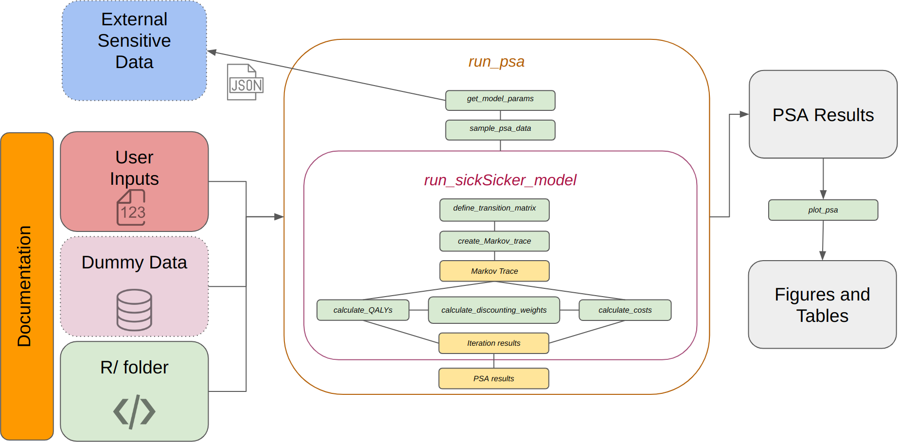

```{r, include = FALSE}
knitr::opts_chunk$set(
  collapse = TRUE,
  comment = "#>"
)
```

```{r setup}
library(sicksickerPack)
```

## Introduction

The sicksickerPack was created using mainstream R package development tools
and provides a set of functions that allow users to run the Sick Sicker model.

The Sick Sicker model is an educational state transition model first published 
by @enns2015identifying. This model simulates a hypothetical cohort of healthy 
25-years-olds susceptible to a hypothetical disease with two stages of illness,
'_Sick_' (S1) and '_Sicker_' (S2). Those who acquire the disease are at higher
risk of death and a decline in quality of life (QoL) than their healthy 
counterparts. 

The Sick Sicker model simulates the cost-effectiveness of a hypothetical 
treatment which improves the QoL for those in S1 but has no impact on the QoL
for those in the S2 state. The treatment strategy targets all affected 
individuals, leading to treatment costs for all, even though only those in S1
receive any benefit.

## Methods

```{r out.width = '95%', echo = FALSE, fig.cap='Schematic showing how the sicksickerPack R Package works.'}

```

The primary function we introduce is `run_sickSicker_model()`. This wrapper 
function is specific to the Sick-Sicker model. When called, this function either
fetches model parameters from a remote server or API using `get_model_params()`,
or uses data specified by the user. It then calls several helper functions to
construct the model's transition matrix, Markov trace and calculates the
cost-effectiveness outcomes.

The other functions included in the source code include:

- `run_psa()`: A generic function that uses parameter-related information to 
generate parameter configurations and perform probabilistic sensitivity analysis
(PSA). This function utilises the `sample_psa_data()` function to draw parameter
configurations before calling `run_sickSicker_model()` to evaluate each of the
sets.
- `define_transition_matrix()`: As suggested by its name, this function 
constructs a transition probability matrix and is suitable to use for any Markov
model conforming to the Markovian (memory-less) assumption.
- `create_Markov_trace()`: Besides the model’s time horizon, this function uses 
the transition matrix to create a Markov trace.
- `calculate_discounting_weights()`: This function estimates the discount 
weights corresponding to each model cycle.
- `calculate_costs()`: This function employs a Markov trace, discounting 
weights, and the costs associated with each modelled state to calculate the 
costs associated with each model cycle.
- `calculate_QALYs()`: uses the same logic as `calculate_costs()` but calculates
the Quality Adjusted Life Years (QALYs) accrued in each cycle using the 
utilities associated with each simulated state.
- `plot_psa()`: A bridging or interface function which passes outputs of the
`run_psa()` function to the `bcea()` function from the **`BCEA`** package 
@BCEA2017. It generates a cost-effectiveness table and draws the 
cost-effectiveness plane (CEP), cost-effectiveness acceptability curve (CEAC), 
cost-effectiveness acceptability frontier (CEAF), and the expected value of 
perfect information (EVPI) plot.
- `get_model_params()`: Fetches the model parameters from a remote server.

Assuming that some model parameters represent sensitive data that may want to be
shared with a few authorised individuals. Hence, the package ships with dummy 
data to aid in testing functions. Permitted users can access sensitive data via
the API address and associated key (password), which are passed to the 
`run_sickSicker_model()` function or `run_psa()` function. Using APIs in R to
host sensitive data is described in @smith2022living. The `get_model_params()` 
function is then called by the `run_sickSicker_model()` or `run_psa()` functions
to retrieve sensitive data from the user-defined API.

In addition to extensive documentation, including usage examples, each of the 
package functions include checks on the user inputs to reduce execution errors 
and erroneous outputs, generally using the **`assertthat`** package in R 
@assertthat2019.

Moreover, unit tests were written for each function to flag if the function does
not meet a set of defined criteria or rules. Each time the code base is changed,
the tests can be re-run to ensure that the changes do not silently break one or
more criteria or rules.

## Results

```{r}
sickSicker_model_results <- run_sickSicker_model(
  params_ = dummy_sickSickerModel_params
)

sickSicker_model_results |> 
  t() |> 
  as.data.frame()
```

The table above lists the results from a deterministic model run using the dummy
data `dummy_sickSickerModel_params`; whereas the plots and table below show the
summary of the PSA results generated using the dummy PSA data 
`dummy_sickSickerModel_psa_params`.

```{r, results='asis'}
PSA_results <- run_psa(
  model_func_ = run_sickSicker_model,
  model_func_args_ = list(
    age_init_ = 25,
    age_max_  = 55,
    discount_rate_ = 0.035
  ),
  psa_params_names_ = dummy_sickSickerModel_psa_params$
    psa_params_names,
  psa_params_dists_ = dummy_sickSickerModel_psa_params$
    psa_params_dists,
  psa_params_dists_args_ = dummy_sickSickerModel_psa_params$
    psa_params_dists_args,
  n_sim_ = 1000
)

PSA_plots <- plot_psa(
  psa_results_ = PSA_results,
  interventions_ = c("Status quo", "Treatment"),
  reference_ = 2,
  maximum_threshold_ = 1e5,
  effects_prefix_ = "QALYs_",
  costs_prefix_ = "Cost_"
)
```

```{r}
PSA_plots[["CE table"]]
```

```{r out.width = '70%', dpi=720, fig.align='center', fig.width=5}
PSA_plots[["CE plane"]]
```

```{r out.width = '70%', dpi=720, fig.align='center', fig.width=5}
PSA_plots[["CEAC"]]
```

```{r out.width = '70%', dpi=720, fig.align='center', fig.width=5}
PSA_plots[["CEAF"]]
```

```{r out.width = '70%', dpi=720, fig.align='center', fig.width=5}
PSA_plots[["EVPI"]]
```

## Discussion

The sicksickerPack R package provides a simple case study whereby a simple model
(The Sick Sicker model) has been converted into a stand-alone R package with 
documentation and unit tests included. Interested parties could install the 
package using `devtools::install_github("dark-peak-analytics/sicksickerPack")`,
run the model with the dummy data, or the sensitive data from the remote server
if they have been provided with the key, and review, understand or upgrade each 
function.

## Conclusion

This vignette described how an existing decision-analytic model was transformed 
from a script-based model to a package-based model. 

## References

